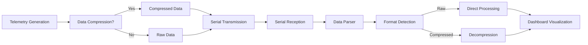

# UAV Telemetry Simulator

A comprehensive web application for simulating and visualizing UAV (Unmanned Aerial Vehicle) telemetry data with real-time serial communication and data compression capabilities.

## Features

### 🛰️ Real-time Telemetry Simulation
- **GPS/GNSS Data**: Realistic NMEA format GPS coordinates with altitude tracking
- **Environmental Sensors**: Temperature (LM35), Gas sensors (CO, NO2, SO2)
- **Battery Monitoring**: Voltage, current, percentage, and charging status
- **Realistic Data Generation**: Physics-based simulation with noise and trends

### 📡 Serial Communication
- **Bidirectional Communication**: Send commands and receive telemetry data
- **Automatic Transmission**: Real-time data streaming to connected devices
- **AT Command Support**: Full AT command interface for device configuration
- **Connection Management**: Robust connection handling with recovery mechanisms

### 🗜️ Data Compression System
- **Real-time Compression**: Reduce bandwidth usage by 60-80%
- **Multiple Algorithms**: Delta, Run-Length, Dictionary, and Huffman compression
- **Automatic Format Detection**: Seamlessly handle both raw and compressed data
- **Performance Metrics**: Real-time compression ratio and processing time monitoring

### 📊 Advanced Dashboard
- **Live Visualization**: Real-time charts, maps, and instrument panels
- **Data Processing**: Automatic parsing and decompression of incoming data
- **Multi-format Support**: Visualize both raw and compressed telemetry streams
- **Historical Data**: Track and analyze telemetry trends over time

## Telemetry Data Flow

### Overview
The application supports two telemetry data formats: **Raw** and **Compressed**. The dashboard can automatically detect and process both formats for visualization.



### Data Formats

#### Raw Data Format
```json
{
  "gnss": "$GPGGA,123456,3352.128,S,15112.558,E,1,8,0.9,100.0,M,,M,,*5C",
  "temperature": 25.5,
  "coLevel": 1.2,
  "no2Level": 100.0,
  "so2Level": 10.0,
  "voltage": 3.7,
  "current": 1.5,
  "batteryPercentage": 75.0,
  "batteryStatus": "Charging",
  "timestamp": 1640995200000
}
```

#### Compressed Data Format
```json
{
  "gnss": "eJwLyczPSCwpyi+yUsg...", // Base64 encoded
  "temp": "eJwL8A/yczVQcDS3...",    // Base64 encoded
  "co": "eJwLycxLLSgGAA==",        // Base64 encoded
  "no2": "eJwLycxLLSgGAA==",       // Base64 encoded
  "so2": "eJwLycxLLSgGAA==",       // Base64 encoded
  "batt": "eJwLycxLLSgGAA==",      // Base64 encoded
  "ts": 1640995200000,
  "compressionMetrics": {
    "compressionRatio": 3.2,
    "processingTime": 1.5
  }
}
```

### Data Processing Pipeline

#### 1. Data Generation (`TelemetryContext`)
- Generates realistic sensor data using physics-based models
- Supports both raw and compressed output based on user settings
- Handles automatic serial transmission

#### 2. Serial Communication
- **Transmission**: Automatic JSON streaming via serial port
- **Reception**: Real-time data reading and buffering
- **Error Handling**: Robust connection management and recovery

#### 3. Data Bridge (`SerialTelemetryBridge`)
```typescript
// Automatically detects and forwards telemetry data
const isTelemetryData = (data: any): boolean => {
  // Raw data signature
  const hasRawSignature = (
    data.gnss && data.gnss.startsWith('$GPGGA') &&
    (data.temperature !== undefined || data.voltage !== undefined)
  );
  
  // Compressed data signature  
  const hasCompressedSignature = (
    data.gnss && !data.gnss.startsWith('$GPGGA') && // Base64 encoded
    (data.temp !== undefined || data.batt !== undefined)
  );
  
  return hasRawSignature || hasCompressedSignature;
};
```

#### 4. Data Processing (`DataProcessor`)
- **Format Detection**: Automatically identifies raw vs compressed data
- **Decompression**: Uses specialized decompressors for each sensor type
- **NMEA Parsing**: Extracts GPS coordinates from NMEA strings
- **Normalization**: Converts all data to standard dashboard format

#### 5. Dashboard Visualization
- **Real-time Updates**: Live charts and instrument panels
- **Map Integration**: GPS tracking with Leaflet maps  
- **Performance Metrics**: Compression ratio and processing time display
- **Data Statistics**: Packet count and processing performance

### Setup Instructions

#### 1. Start the Development Server
```bash
npm run dev
```

#### 2. Configure Telemetry Simulation
1. Navigate to `/telemetry` page
2. Configure sensor parameters (GPS, temperature, gas levels, battery)
3. Enable/disable compression as needed
4. Set compression metrics display preferences

#### 3. Connect Serial Device
1. Go to `/dashboard` or `/terminal` page
2. Click "Connect" and select your serial port
3. Ensure proper baud rate settings (default: 9600)

#### 4. Start Data Flow
1. In `/telemetry` page, click "Start Simulation"
2. Data will automatically transmit via serial port
3. Dashboard will receive and visualize the data in real-time
4. Switch between raw and compressed modes to see performance differences

### Dashboard Components

#### Real-time Data Cards
- **Battery Status**: Voltage, current, percentage with color-coded indicators
- **Altitude**: Current elevation above sea level
- **Compression Performance**: Real-time compression ratio and efficiency
- **Processing Latency**: Data processing and decompression time

#### Interactive Map
- **GPS Tracking**: Real-time position updates
- **Flight Path**: Historical track visualization
- **Coordinate Display**: Formatted latitude/longitude

#### Sensor Panels
- **Temperature**: Real-time temperature readings with LM35 simulation
- **Gas Sensors**: CO, NO2, SO2 levels with percentage bars
- **System Status**: Connection status, flight time, last update info

### Compression Performance

#### Typical Compression Ratios
- **GPS Data**: 2.5-3.5x reduction
- **Temperature**: 3-4x reduction  
- **Gas Sensors**: 2-3x reduction
- **Battery Data**: 2.5-3x reduction
- **Overall**: 60-80% bandwidth savings

#### Real-time Metrics
- Compression ratio calculation
- Processing time measurement
- Performance classification (Excellent/Good/Fair/Poor)
- Statistics tracking (raw vs compressed packet counts)

### Troubleshooting

#### Dashboard Not Receiving Data
1. Ensure serial connection is active (green status indicator)
2. Verify telemetry simulation is running
3. Check browser console for JSON parsing errors
4. Confirm `SerialTelemetryBridge` is included in dashboard page

#### Compression Issues
1. Verify compression is enabled in telemetry settings
2. Check decompressor initialization
3. Monitor compression metrics for processing errors
4. Ensure Base64 encoding/decoding is working correctly

#### Connection Problems
1. Check serial port permissions
2. Verify baud rate settings match between devices
3. Use connection recovery system (automatic)
4. Clear browser cache if port references are stale

## Technology Stack

- **Frontend**: Next.js 14, React 18, TypeScript
- **UI Components**: Tailwind CSS, Shadcn/ui
- **State Management**: Zustand with persistence
- **Maps**: Leaflet with React-Leaflet
- **Database**: Prisma with SQLite
- **Authentication**: NextAuth.js
- **Compression**: Custom algorithms (Delta, RLE, Dictionary, Huffman)

## License

This project is licensed under the MIT License.

